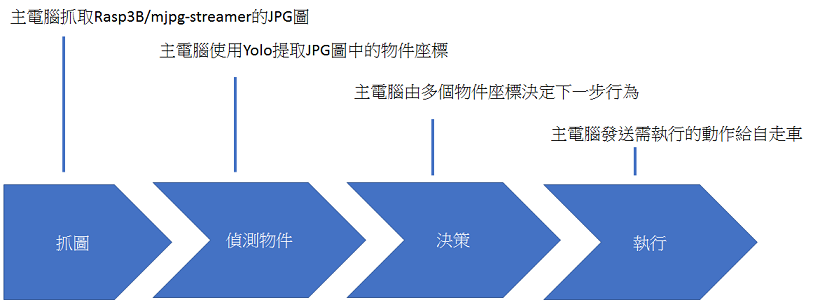

# toy_car_auto_drive_by_yolo
Using yolo 8  for toy car auto drive  
[[Video_1]](https://youtu.be/0ZFqMQCc-RQ) 
 
[[Video_2]](https://youtu.be/89byK5cuNVY) 
 
[[Video_3]](https://youtu.be/P7JQ3RkcZVs) 
 

使用yolo實作玩具車自動行駛  
這個版本主要是為了  
容易學習  
容易學習  
容易學習  

 

 
為了容易學習,把系統分成二個單元  
單元1:PC由WiFi讀取玩具車上的樹莓3B/Webcam取得影像  
單元2:PC由藍芽操作玩具車的動力系統  

 
如果把Yolo放在玩具車的樹莓3B上,省每秒可以做更多次的判斷,會有更好的駕駛行為.  
但是這需要更多的編程工藝水準.  

為了避開視覺投影變形,以及WiFi傳輪延時的問題.  
把攝像頭偏置,並偏15度左右,可以閃過這兩個問題.  
等車子會動後,再來面對這個問題.  
但是這需要更多的編程工藝水準.  

使用直排輪的迷你三角錐當作引導物件  
玩具車只有四個動作,直行,往左前,往右前,停止.  

可分成4個單元  
1.圖片取得 get picture  
2.物件偵測 detect object  
3.決策 decision  
4.執行  execution  
 

 
## 1.圖片取得
為了容易學習,使用樹莓3B架設webcam.
這是很成熟的技術了. 架設流程請參考如下.更多細節自行google  
greatcattw/webcam_rasp_for_auto_drive_mjpg-streamer 
 
實用上,Linkit7688/mt7688更省電/輕量化/省錢的選擇.
 
## 2.物件偵測
本案使用ubuntu22  

## 3.決策
使用python  
為了容易學習,  
basic1.py,處理的邏輯為  
最下方的角錐,位於圖片水平中央區域,直行  
最下方的角錐,位於圖片水平左側區域,往右前  
最下方的角錐,位於圖片水平右側區域,往左前  
沒有偵測到角錐,停止  
 

 
basic2.py,加入手勢啟動與停止  
 

 

## 4.執行
藍芽 + arduino控制馬達,這是很成熟的技術了.  
架設流程請參考這邊.更多細節自行google    
greatcattw/control_toy_car_over_bluetooth  
 
也可以找些機電整合好的車台,下指今即可動作,新手可以專注在AI的處理.  
履帶類的車台是最佳的選擇.不晃動.不同的路面材質不會影響到行走表現.  
圖中的二輪車(淘寶:輪趣科技/B570),因為加了網路攝影機,配重變了,要重設PID參數,不然會晃動,累~  
 

 
 
# 架設    
## 軟體架設:  
安裝 ubuntu 22  
安裝 anacoda  
安裝會用到旳pyhton套件  
操作參考指令  
sudo apt-get update  
  
cd ~/xxxx/sw_anaconda/  
./Anaconda3-2024.02-1-Linux-x86_64.sh  
...  
[enter]  
[space]x74  
  
---Anaconda3 will now be installed into this location:  
---/home/xxxxxx/anaconda3  
yes  
  
---You can undo this by running `conda init --reverse $SHELL`? [yes|no]  
yes  
  
new_terminal_window  
  
conda env create -f environment_yolov8.yml  
pip install ultralytics  
pip install keyboard  
pip install pyserial  
  
python yolov8_pred_test.py  
if ok, you will see:  

   

## 硬體架設:  
本案使用  
PC(Linux) --- USB2UART(FT232) --- HC05(BT host) --- HC05(BT device) --- arduino --- 電子變速器2x --- 馬達x2  
若安裝OK,應該會有/dev/ttyUSB0這個節點,需要開放權限  
sudo chmod a+rw /dev/ttyUSB0  

# 測試
## 連線測試
設定UART  
stty -F /dev/ttyUSB0 ispeed 9600 cs8 -parenb -cstopb  

馬達低速正轉  
echo -ne "\x1\x6e\x2\x6e\x3" > /dev/ttyUSB0  

馬達停止  
echo -ne "\x1\x64\x2\x64\x3" > /dev/ttyUSB0  

## 運轉測試
把玩具車架高,輪子空轉,用以觀查攝影機與輪子的狀況.  
執行  
python basci1.py  
把角錐放在攝影機前,兩個輪子應該都會運轉.  
把角錐放在攝影機右側,左側的輪子會轉動較快.  
把角錐放在攝影機左側,右側的輪子會轉動較快.  
攝影機看不到角錐.兩個輪子都會停止運轉.  

# 其它
## 鏡頭選用
一般視訊用的鏡頭視角較窄,可能略為轉向,就看不到角錐了.選用廣角視角的攝影機,要找低畸變的的.  
 
常見的Logi C270,視角55度  
 
   
135度的USB攝影機  

...
 
 
測試方式  
 
 
左是logi_c270  

...

 
[test](test/test.md) 
